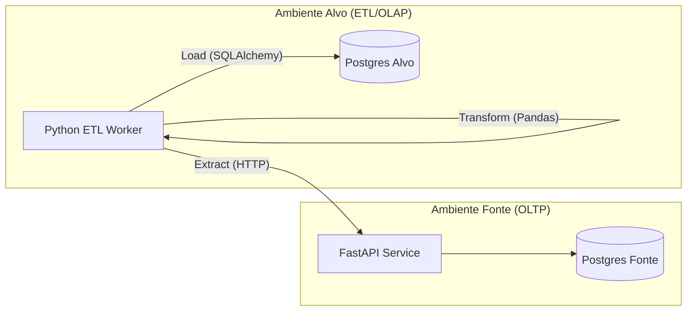

# 🌪️ Desafio Delfos - ETL Pipeline


Este repositório contém a solução para o desafio técnico da Delfos. O projeto implementa um pipeline completo de **Engenharia de Dados**, simulando a ingestão, processamento e armazenamento de séries temporais geradas por sensores de energia eólica.

---

## 📑 Sumário

1. [Sobre o Projeto](#-sobre-o-projeto)
2. [Arquitetura e Componentes](#-arquitetura-e-componentes)
3. [Stack Tecnológica](#-stack-tecnológica)
4. [Como Rodar (Docker)](#-como-rodar-o-projeto-docker)
5. [Como Rodar (Local)](#-como-rodar-localmente)
6. [Pipeline ETL](#-detalhes-do-pipeline-etl)
7. [Como Rodar os Testes](#-como-rodar-os-testes)
    * [Com Docker](#com-docker-recomendado)
    * [Localmente](#localmente-sem-docker)
8. [Decisões Técnicas](#-decisões-técnicas)
9. [Dagster (Bônus)](#-dagster-bônus)

---

## 📖 Sobre o Projeto

O objetivo é orquestrar um fluxo onde dados brutos de alta frequência (gerados a cada minuto) são extraídos, agregados em janelas de 10 minutos (downsampling) e normalizados para um formato analítico (Tidy Data) em um banco de dados destino.

## 🏗 Arquitetura e Componentes

O sistema é modularizado em dois serviços principais isolados:

*   **`fonte/`**: API RESTful construída com FastAPI e SQLAlchemy Async. Simula sensores de parques eólicos gerando dados de alta frequência (minuto a minuto), expondo endpoints para consulta e geração de dados sintéticos (`seed`).
*   **`alvo/`**: O Worker de ETL responsável por extrair os dados da API Fonte, transformá-los utilizando **Pandas** (cálculo de média, min, max, std) e carregá-los em um banco PostgreSQL dedicado utilizando técnicas de *Upsert*.

### Fluxo de Dados



## 🛠 Stack Tecnológica

*   **Linguagem:** Python 3.12
*   **Gerenciador de Pacotes:** `uv` (pela alta performance e lockfiles confiáveis)
*   **Web Framework:** FastAPI + Pydantic
*   **Database ORM:** SQLAlchemy 2.0 (Async) + Alembic (Migrations)
*   **Processamento de Dados:** Pandas
*   **Infraestrutura:** Docker & Docker Compose
*   **Testes:** Pytest, Asyncio, Testcontainers

---

## 🚀 Como Rodar o Projeto (Docker)

Esta é a maneira recomendada, pois isola redes e bancos de dados.

### 1. Subir o ambiente
```bash
docker compose up -d --build
```
Isso provisionará:
*   `app_fonte` (API): http://localhost:8000
*   `postgres_fonte`: Porta 5433
*   `postgres_alvo`: Porta 5434
*   `app_alvo`: Container worker em modo de espera.

### 2. Popular a Fonte (Seed)
Gere dados sintéticos na API Fonte para simular o histórico de sensores.
Exemplo: Gerar dados para o dia 01/01/2024.

```bash
curl -X POST "http://localhost:8000/api/seed" \
     -H "Content-Type: application/json" \
     -d '{"start_date": "2024-01-01T00:00:00", "days": 1}'
```

### 3. Executar o ETL
Dispare o comando no container do worker para processar o dia desejado.

```bash
docker compose exec app_alvo python -m app.main --date 2024-01-01
```
*O script irá extrair os 1440 pontos de dados (minuto a minuto), agregar em janelas de 10 minutos e salvar no banco alvo.*

---

## 💻 Como Rodar Localmente

Se preferir rodar fora do Docker, você precisará do `uv` instalado e de bancos de dados Postgres locais.

1.  **Configurar Variáveis de Ambiente:**
    Crie um arquivo `.env` nas pastas `fonte/` e `alvo/` apontando para seu banco local.

2.  **Instalar dependências e Rodar:**

    **Terminal 1 (Fonte):**
    ```bash
    cd fonte
    uv sync
    uv run alembic upgrade head
    uv run fastapi dev app/main.py
    ```

    **Terminal 2 (Alvo):**
    ```bash
    cd alvo
    uv sync
    uv run alembic upgrade head
    # Rodar o ETL
    uv run python -m app.main --date 2024-01-01
    ```

---

## ⚙️ Detalhes do Pipeline ETL

1.  **Extract:** O serviço consulta a API Fonte paginada por dia. Utilizamos `httpx` assíncrono para garantir performance na I/O.
2.  **Transform:**
    *   Conversão para DataFrame Pandas.
    *   Resample temporal de `10T` (10 minutos).
    *   Cálculo de agregações: `mean`, `min`, `max`, `std`.
    *   *Unpivoting*: Transformação de formato largo (colunas) para formato longo (tabela `TargetData` e `Signal`).
3.  **Load:**
    *   Verificação e criação dinâmica de novos Sinais na tabela `signal`.
    *   Inserção em lote com tratamento de conflitos (`ON CONFLICT DO UPDATE`), garantindo idempotência (pode rodar o ETL várias vezes para o mesmo dia sem duplicar dados).

---

## 🧪 Como Rodar os Testes

Os testes automatizados garantem a integridade tanto da API quanto da lógica de transformação de dados.

### Com Docker (Recomendado)

O projeto utiliza `Testcontainers` para garantir que os testes de integração rodem contra um banco PostgreSQL real, e não mocks ou SQLite, garantindo fidelidade ao ambiente de produção.

Para rodar todos os testes:

```bash
# Testes da API Fonte
docker compose exec app_fonte uv run pytest

# Testes do Pipeline ETL
docker compose exec app_alvo uv run pytest
```

### Localmente (Sem Docker)
Você precisará do `uv` instalado e de bancos de dados Postgres rodando localmente (ou via TestContainers).

```bash
# Na pasta 'fonte/'
cd fonte
uv sync
uv run pytest

# Na pasta 'alvo/'
cd alvo
uv sync
uv run pytest
```

---

## 🧠 Decisões Técnicas

*   **Async/Await:** Utilizado em todo o projeto (Banco e API) para maximizar o throughput, já que a operação é intensiva em I/O.
*   **Postgres vs Timescale:** O projeto utiliza Postgres padrão, mas a modelagem no Alvo (Tabela `Data` com chave composta `timestamp` + `signal_id`) foi pensada para ser compatível com hiper-tabelas do TimescaleDB no futuro.
*   **Uv Package Manager:** Escolhido pela velocidade de instalação e resolução de dependências, reduzindo drasticamente o tempo de build do Docker.
*   **Entrypoints Inteligentes:** Os containers possuem scripts que garantem que as migrações do banco (Alembic) sejam aplicadas automaticamente antes da aplicação iniciar.

---

## 🌟 Dagster (Bônus)

Esta implementação é uma **funcionalidade bônus** e um **desafio de aprendizado**. O autor não possui experiência prévia extensa com Dagster, mas incluiu esta ferramenta para demonstrar capacidade de adaptação e aprendizado de novas tecnologias.

**Dagster** é uma plataforma moderna de orquestração de dados que permite definir, agendar e monitorar pipelines de dados de forma declarativa e testável.

### Como Acessar a UI

Assumindo que o serviço Dagster está em execução via Docker:

```bash
# Acesse a interface web do Dagster
http://localhost:3000
```

A interface do Dagster permite visualizar o status dos pipelines, executar jobs manualmente, e monitorar o histórico de execuções.